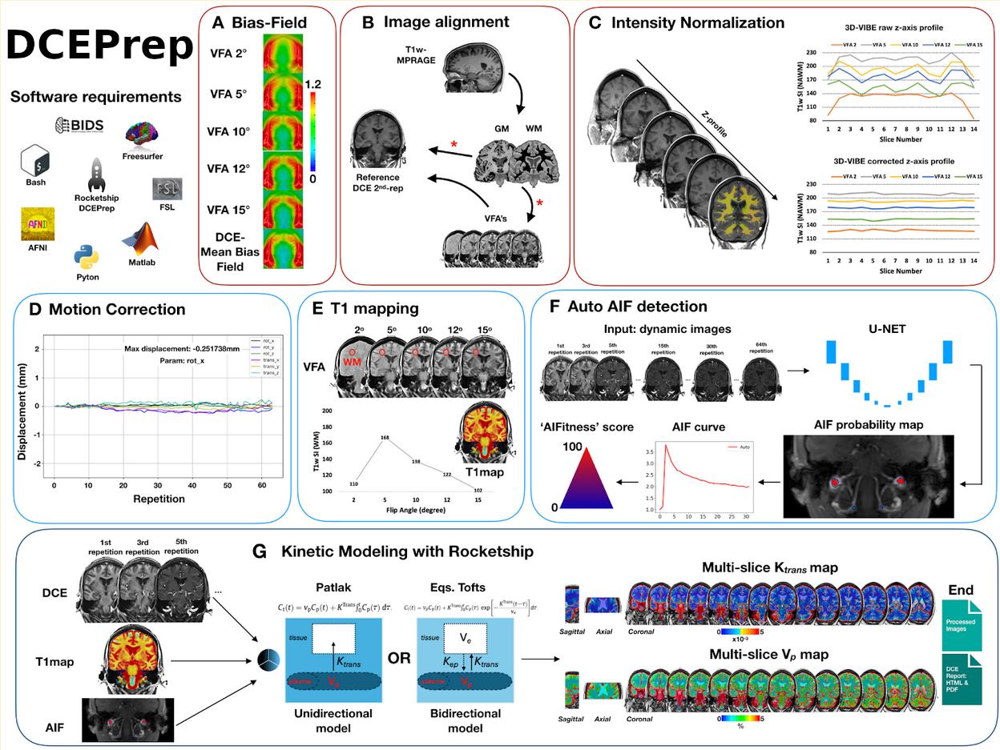

# DCEprep

A preprocessing and analysis pipeline for Dynamic Contrast-Enhanced (DCE) MRI data. Handles VFA-based T1 mapping, bias field correction, z-axis normalization, motion correction, AIF selection, and Ktrans parameter mapping, with automated QC reporting.



#### If you use this software in your research, please cite:

> Barnes S, et al. Automated DCE-MRI processing with DCEPrep for Blood-Brain Barrier permeability in a multi-site aging study. *Pending*. 2026.

---

## Table of Contents

- [Installation](#installation)
  - [Docker (Recommended)](#docker-recommended-easy-consistent-18-gb)
  - [Without Docker](#without-docker)
    - [Dependencies](#dependencies-without-docker)
- [Data Organization](#data-organization)
- [Pipeline Structure](#pipeline-structure)
  - [Preprocessing: preprocess_all.sh](#preprocessing-preprocess_allsh)
  - [Analysis: DCE_all.sh](#analysis-dce_allsh)

---

## Installation

Clone the repository. The `main` branch is stable. Check out a specific tag for a pinned release.

```bash
git clone https://github.com/petmri/DCEPrep.git
```

### Docker (Recommended, easy, consistent, ~18 GB)

The easiest way to get started is with the included `run_docker.sh` script, which will automatically pull the Docker image and launch a container.

> **Important:** Make sure the following are shared (mounted) with the Docker container:
> - MATLAB license file
> - FreeSurfer license file
> - Your data directory
> - Script preference folder (`docker/files/`)
> - `/etc/`
>
> Edit line 24 of `run_docker.sh` to set your data directory before running.

```bash
./run_docker.sh
```

To pull the image manually:

```bash
docker pull lsaca05/dce:<MATLAB_release>-<branch>
# Example:
docker pull lsaca05/dce:R2022a-dev
```

See [Docker Hub tags](https://hub.docker.com/repository/docker/lsaca05/dce/tags) for available releases.

### Without Docker

Setup a Python virtual environment and install dependencies from `venv_requirements.txt`:

```bash
cd DCEPrep
python3 -m venv tf
source tf/bin/activate
pip install -r venv_requirements.txt
```

`conda` is also supported — install packages from `venv_requirements.txt` into your conda environment.

#### Dependencies (Without Docker)
If running without Docker, in addition to the Python packages in `venv_requirements.txt`, the following software must be installed and accessible in your system's PATH:
| Dependency | Version / Notes |
|---|---|
| FSL | 6.0 |
| ANTs | 2.6.2 |
| FreeSurfer | Linux-centos6_x86_64-stable-pub-v6.0.0-2beb96c (wm parcellation) |
| MATLAB | R2023a |
| Python | 3.8.10 or 3.10 |
| ROCKETSHIP + parametric_scripts | 1.2 |

---

## Data Organization

All data is assumed to be [BIDS](https://bids-specification.readthedocs.io/) compliant.

---

## Pipeline Structure

### Preprocessing: `preprocess_all.sh`

#### Inputs

| File | Pattern |
|---|---|
| VFA images (any number of flip angles) | `sub-##_ses-##_flip-##_VFA.nii.gz` |
| DCE image | `sub-##_ses-##_DCE.nii.gz` |
| T1-weighted image | `sub-##_ses-##_T1w.nii.gz` |

#### Main Outputs

| File |
|---|
| `dce/sub-##_ses-##_desc-bfcz_DCE.nii.gz` |
| `anat/sub-##_ses-##_space-DCEref_T1map.nii` |
| `anat/sub-##_ses-##_space-DCEref_VFA.nii.gz` |
| `dce/sub-##_ses-##_desc-AIF_T1map.nii.gz` |
| `anat/sub-##_ses-##_space-DCEref_desc-brain_mask.nii.gz` |

#### Options

| Flag | Description |
|---|---|
| `-d [rawdata_path]` | **Required.** Path to your BIDS raw data folder. |
| `-a [suffix]` | AIF suffix (default: `desc-AIF_mask`). `.nii.gz` is appended automatically. |
| `-A [mode]` | Enable AutoAIF: `A` (fully automatic), `M` (manual if available), or `T` (manual + training if available). Requires the [vascular_function repo and weights](https://github.com/petmri/vascular_function). |
| `-b` | Enable first round of bias field correction. |
| `-B` | Enable second round of bias field correction (post-Z-norm, if enabled). |
| `-c` | Clean the case's derivative folder before processing. Ensures fresh runs but disables skips. |
| `-C [name]` | Enable comparison mode. Outputs all files to a named directory within each timepoint. Useful for comparing runs (e.g., no corrections vs. corrections). |
| `-m` | Enable motion correction. |
| `-s` | Skip preprocessing if DCE input file already exists. |
| `-t` | Only run up to T1 mapping. |
| `-T [dir_path]` | Target specific subject(s)/session(s) (default: `sub-*/ses-*/`). |
| `-w [path]` | Path to AutoAIF weights file. |
| `-Z` | Enable z-slice normalization. |

#### Example

```bash
./preprocess_all.sh -d /media/network_mriphysics/USC-PPG/bids_test/rawdata -b -c -Z -A -C noMC
```

#### Step Summary

1. **Brain Extraction** of T1w MPRAGE using `HD-BET` with default weights (does not brain mask VFAs).
2. <details>
    <summary><b>DCE Motion Correction</b> — FSL <code>mcflirt</code>, targeting 2nd frame with mutual info cost function</summary>
    <code>mcflirt -in $source_dir/dce/${PREFIX}_DCE.nii.gz -refvol 1 -cost mutualinfo -report -plots -o dce/${PREFIX}_desc-hmc_DCE.nii</code>
   </details>
3. <details>
    <summary><b>MPRAGE → DCE Registration</b> — ANTs <code>antsRegistration</code></summary>
    <code>
    antsRegistration --verbose 0 --dimensionality 3 --float 0
        --collapse-output-transforms 1 --output [ anat/${PREFIX}_${REF_SPACE}_T1w,anat/${PREFIX}_${REF_SPACE}_T1w.nii.gz ]
        --interpolation Linear --use-histogram-matching 0 --winsorize-image-intensities [ 0.005,0.995 ]
        --transform Rigid[ 0.1 ] --metric MI[ $DCE_REF_VOL,${source_dir}/anat/${PREFIX}_T1w.nii.gz,1,32,Regular,0.25 ]
        --convergence [ 1000x500x250x100,1e-6,10 ] --shrink-factors 12x8x4x2 --smoothing-sigmas 4x3x2x1vox
    </code>
   </details>
4. <details>
    <summary><b>VFA → DCE Registration</b> — ANTs <code>antsRegistration</code></summary>
    <code>
    antsRegistration --verbose 0 --dimensionality 3 --float 0
        --collapse-output-transforms 1 --output [ anat/${PREFIX}_flip-${VFA}_${REF_SPACE},anat/${PREFIX}_flip-${VFA}_${REF_SPACE}_VFA.nii.gz ]
        --interpolation Linear --use-histogram-matching 0 --winsorize-image-intensities [ 0.005,0.995 ]
        --transform Rigid[ 0.1 ] --metric MI[ $DCE_REF_VOL,$source_dir/anat/${PREFIX}_flip-${VFA}_VFA.nii.gz,1,32,Regular,0.25 ]
        --convergence [ 1000x500x250x100,1e-6,10 ] --shrink-factors 12x8x4x2 --smoothing-sigmas 4x3x2x1vox
    </code>
   </details>
5. <details>
    <summary><b>MPRAGE White Matter Segmentation</b> — FSL <code>fast</code></summary>
    <code>
    fast -t 1 -n 3 -H 0.1 -I 4 -l 20.0 -b --nopve -g -o anat/${PREFIX}_label- anat/${PREFIX}_desc-brain_T1w.nii.gz
    </code>
   </details>
6. **Apply MPRAGE → DCE transform to WM mask** — ANTs `antsApplyTransforms`
7. <details>
    <summary><b>VFA Bias Field Correction</b> — FSL <code>fast</code></summary>
    <code>
    fast -t 1 -n 3 -H 0.1 -I 4 -l 20.0 -B --nopve -o anat/${PREFIX}_${VFA}_${REF_SPACE}_desc-brain_VFA.nii.gz
    </code>
   </details>
8. **VFA Z-axis Normalization** — double Gaussian fitting (`VFA_norm.py`)
9. **Second VFA Bias Field Correction** — FSL `fast`
10. **T1 Map Generation** — ROCKETSHIP
11. **Apply MPRAGE → DCE transform to brain mask** — ANTs `antsApplyTransforms`
12. **AIF Drawing via Neural Network** — ensures AIF is included within the brain mask
13. <details>
    <summary><b>DCE Bias Field Correction</b> — averages bias fields from the 1st + 8 evenly spaced temporal samples via FSL <code>fast</code></summary>
    <code>
    fast -t 1 -n 3 -H 0.1 -I 4 -l 20.0 -b --nopve -o rep_$((rep_interval*i-1)).nii
    </code>
    </details>
14. **DCE Z-axis Normalization** — double Gaussian fitting (`DCE_norm.py`)

---

### Analysis: `DCE_all.sh`

#### Inputs

| File |
|---|
| `dce/sub-##_ses-##_desc-bfcz_DCE.nii.gz` |
| `anat/sub-##_ses-##_space-DCEref_T1map.nii` |
| `anat/sub-##_ses-##_space-DCEref_VFA.nii.gz` |
| `dce/sub-##_ses-##_desc-AIF_T1map.nii.gz` |
| `anat/sub-##_ses-##_space-DCEref_desc-brain_mask.nii.gz` |

#### Main Outputs

| File |
|---|
| `sub-##_ses-##_Ktrans.nii` |
| `sub-##_ses-##_vp.nii` |
| `case_report.html` |
| `population_report.html` |

#### Options

| Flag | Description |
|---|---|
| `-d [path]` | **Required.** Path to raw BIDS data directory. |
| `-C [name]` | Enable comparison mode. Copies essential files from a standard run if a preprocessed run of the same name does not exist. |
| `-f` | Enable FreeSurfer WM parcellation for subregion analysis. |
| `-s` | Skip cases already processed. |
| `-S` | Enable smoothing of DCE input. |
| `-T [dir_path]` | Target specific subject(s)/session(s) (default: `sub-*/ses-*/`). |

#### Example

```bash
./DCE_all.sh -d /media/network_mriphysics/USC-PPG/bids_test/rawdata -s -C noMC
```

#### Step Summary

1. **Ktrans Mapping** — ROCKETSHIP
2. **Gray Matter & CSF Masking** — create, align, and apply masks with `antsApplyTransforms` and `fslmaths`
3. **QC Analysis** — run `ktrans_analysis.py` and `ktrans_report.py`
4. **Case Report** — generate `case_report.html` for each case via `case_report.py`
5. **Population Report** — after all cases finish, generate `population_report.html` via `population_report.py`
