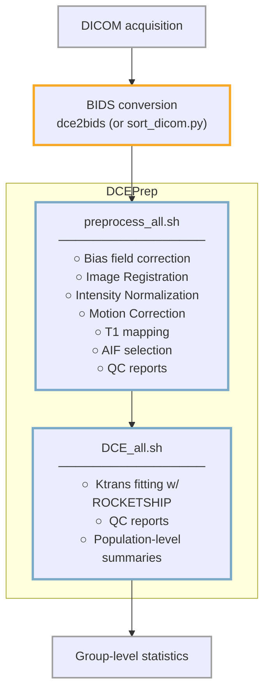

# DCEPrep

<!-- dceasy-pipeline -->
## Where this fits

DCEPrep automates steps 2 through 6. The full DCEasy pipeline:

```mermaid
%%{init: {"theme":"base","flowchart":{"useMaxWidth":false,"htmlLabels":true,"curve":"linear","nodeSpacing":26,"rankSpacing":38,"padding":12},"themeVariables":{"fontFamily":"IBM Plex Sans, Helvetica, sans-serif","fontSize":"17px","lineColor":"#9aa2a4"}}}%%
flowchart LR
  convert["<span style='font-size:17px;font-weight:600'>1 · Convert</span><br/><span style='font-size:13px;opacity:.7'>DICOM → BIDS</span><br/><span style='font-family:JetBrains Mono,monospace;font-size:12px;letter-spacing:.02em;opacity:.9'>dce2bids</span>"]
  prep["<span style='font-size:17px;font-weight:600'>2 · Preprocess</span><br/><span style='font-size:13px;opacity:.7'>motion · bias</span><br/><span style='font-family:JetBrains Mono,monospace;font-size:12px;letter-spacing:.02em;opacity:.9'>DCEPrep</span>"]
  aif["<span style='font-size:17px;font-weight:600'>3 · AIF</span><br/><span style='font-size:13px;opacity:.7'>input function</span><br/><span style='font-family:JetBrains Mono,monospace;font-size:12px;letter-spacing:.02em;opacity:.9'>AutoAIF / AIFArtist</span>"]
  t1["<span style='font-size:17px;font-weight:600'>4 · T1 map</span><br/><span style='font-size:13px;opacity:.7'>VFA / IR</span><br/><span style='font-family:JetBrains Mono,monospace;font-size:12px;letter-spacing:.02em;opacity:.9'>parametric_scripts</span>"]
  pk["<span style='font-size:17px;font-weight:600'>5 · PK fit</span><br/><span style='font-size:13px;opacity:.7'>Ktrans · ve · vp</span><br/><span style='font-family:JetBrains Mono,monospace;font-size:12px;letter-spacing:.02em;opacity:.9'>ROCKETSHIP + Gpufit</span>"]
  analyze["<span style='font-size:17px;font-weight:600'>6 · Analyze</span><br/><span style='font-size:13px;opacity:.7'>compare · QC</span><br/><span style='font-family:JetBrains Mono,monospace;font-size:12px;letter-spacing:.02em;opacity:.9'>ROCKETSHIP</span>"]
  convert --> prep --> aif --> t1 --> pk --> analyze
  subgraph dceprep ["<span style='font-family:JetBrains Mono,monospace;font-size:11px;letter-spacing:.09em'>DCEPREP — AUTOMATED, STEPS 2–6</span>"]
    direction LR
    prep
    aif
    t1
    pk
    analyze
  end
  %% No fill and no color anywhere: the theme owns text colour, so labels stay
  %% legible in light and slate alike. Emphasis is carried by border weight and
  %% a translucent tint that reads on either ground.
  classDef stage fill:none,stroke:#9aa2a4,stroke-width:1px
  classDef on fill:#16707f26,stroke:#16707f,stroke-width:2.5px
  class convert,prep,aif,t1,pk,analyze stage
  style dceprep fill:#16707f12,stroke:#16707f,stroke-width:1.5px,stroke-dasharray:4 4
  %% HIGHLIGHT — the only line that differs per site
  class prep,aif,t1,pk,analyze on
```

[Explore the DCEasy family →](https://dceasy.org/){ .md-button }

---

**A preprocessing and analysis pipeline for Dynamic Contrast-Enhanced (DCE) MRI data.**

DCEPrep handles the full workflow for measuring permeability (Ktrans) from DCE-MRI acquisitions — from raw DICOM to publication-ready QC reports.

---

## What Does DCEPrep Do?

DCEPrep takes BIDS-organized MRI data and runs a two-phase pipeline:

**Phase 1 — Preprocessing (`preprocess_all.sh`)**
Prepares raw DCE and VFA images for kinetic modeling. Steps include brain extraction, image registration, bias field correction, z-axis normalization, T1 mapping, and arterial input function (AIF) selection.

**Phase 2 — Analysis (`DCE_all.sh`)**
Runs pharmacokinetic modeling via [ROCKETSHIP](integration/rocketship.md) to produce Ktrans permeability maps, then generates per-case and population-level HTML/PDF QC reports.

---

## Key Features

- **Fully scriptable** — driven by two shell scripts with straightforward CLI flags
- **BIDS-native** — expects and produces BIDS-compliant data structures
- **Docker-first** — a single container bundles FSL, ANTs, FreeSurfer, MATLAB, and ROCKETSHIP
- **Automated AIF** — optional neural-network-based arterial input function detection
- **Variance Reduction** — z-axis normalization and bias correction designed to reduce scanner variability
- **Automated QC** — per-case and population HTML reports with outlier detection
- **GPU acceleration** — Several steps utilize optional CUDA-based acceleration for faster processing

---

## How DCEPrep Fits In

DCEPrep is part of the **petmri** processing ecosystem. It sits downstream of DICOM conversion and upstream of group-level statistical analysis:

| Color | Meaning |
|---|---|
| Blue | Handled by DCEPrep |
| Amber | Partially supported ([dce2bids](integration/dce2bids.md), or the bundled `sort_dicom.py`) |
| Gray | Outside DCEPrep scope |

See [ROCKETSHIP Integration](integration/rocketship.md) for details on the MATLAB dependency.

---

## The petmri Software Family

DCEPrep is one of several tools maintained by the petmri group for DCE-MRI processing, including [ROCKETSHIP](integration/rocketship.md), [AutoAIF](integration/auto-aif.md), and [dce2bids](integration/dce2bids.md). See [petmri.github.io](https://petmri.github.io/) for an overview of the full software family.

---

## Quick Links

- [Installation](getting-started/installation.md)
- [Process Data](getting-started/process-data.md)
- [Preprocessing Pipeline](user-guide/preprocessing.md)
- [Analysis Pipeline](user-guide/analysis.md)
- [CLI Reference — Preprocessing](reference/preprocessing-cli.md)
- [CLI Reference — Analysis](reference/analysis-cli.md)

---

## Citation

If you use DCEPrep in your research, please cite:

> Barnes S, et al. Automated DCE-MRI processing with DCEPrep for Blood-Brain Barrier permeability in a multi-site aging study. *Pending*. 2026.
